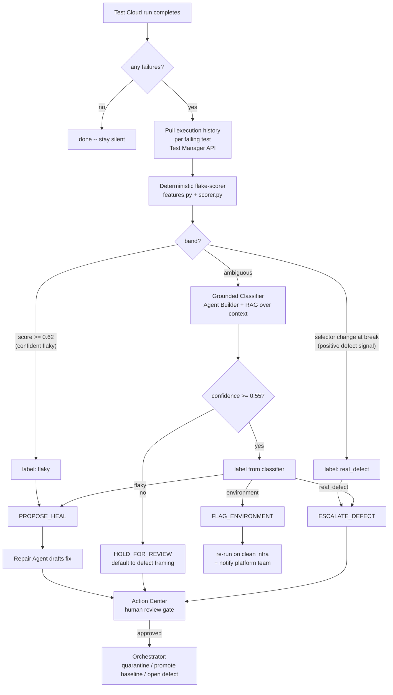

# FlakeWarden architecture

## The thesis: deterministic where exact, generative where messy

Every failure carries two kinds of evidence:

1. **Structured run history** — outcomes, durations, retries, selector-change flags
   across the recent pipeline runs. This is numeric and exact. Reasoning over it
   with an LLM would be slower, non-reproducible, and unauditable. So a
   **deterministic scorer** handles it.
2. **Unstructured context** — stack traces, DOM diffs, commit messages, runner logs.
   This is messy, multi-source natural language. Rules break on it. So a
   **grounded LLM classifier** reasons over it.

FlakeWarden draws the line between the two explicitly and spends the model only
where it earns its keep. On the 150-case corpus, the deterministic scorer alone
resolves ~35% of failures (52/150); the grounded classifier is invoked on the
ambiguous rest.

## Data flow

## The deterministic flake-scorer

`flakewarden/features.py` extracts six exact features from the run window:

| Feature | Flaky signal | Defect signal |
|---|---|---|
| `flip_rate` | high (pass/fail alternation) | low |
| `failure_isolation` | high (scattered failures) | low (one contiguous tail) |
| `pass_after_retry_rate` | high (recovers on retry) | low (stays red) |
| `error_signature_entropy` | high (varied errors) | low (same assertion) |
| `runtime_zscore` | high (timing jitter) | low |
| `selector_change_at_break` | — | **1.0 = strong defect fingerprint** |

`flakewarden/scorer.py` combines them with **fixed, version-controlled weights**
into a 0..1 flake score. A selector change exactly at the break **caps** the score
so a genuine UI break can never auto-route as flaky. Three bands follow:

- `>= 0.62` → confident **flaky**
- selector-change-at-break with low score → confident **real_defect**
- otherwise → **ambiguous** → grounded classifier

Because the weights and thresholds are explicit constants, any score is fully
reproducible and explainable in an audit, which is the point.

## The grounded classifier

`flakewarden/classifier.py` exposes two interchangeable backends behind one
`Prediction` shape:

- **`RuleBasedClassifier`** — deterministic, offline, dependency-free. Reads the
  grounded context (not the label) for well-understood fingerprints. This is the
  honest baseline used for reproducible eval and CI.
- **`AnthropicClassifier`** — sends the same prompt as the Agent Builder agent
  (`agents/classifier_prompt.txt`) to a Claude model. Used live.

In the deployed solution this role is the **Agent Builder Triage Classifier**,
grounded via context grounding (hybrid RAG) over Test Manager results, the object
repository, and SCM commits.

## Governance (why both judges trust it)

- **No autonomous mutation.** Every heal/quarantine/baseline change is a *proposal*
  routed to an Action Center task. `REQUIRES_APPROVAL` in `orchestration.py` encodes
  this; `eval/negative_control.py` asserts it across the whole corpus.
- **Fail safe.** Unexplained or low-confidence failures default to defect framing
  and a human review, never to silent quarantine.
- **Evaluation-driven release gate.** The classifier ships with an eval set and a
  hard gate: safety false-positive rate must be 0% and accuracy ≥ 90% to publish.
- **AI Trust Layer.** PII redaction and audit logging wrap every agent call.

## Mapping to UiPath components

| FlakeWarden module | UiPath component in production |
|---|---|
| `features.py`, `scorer.py` | A coded service / activity invoked by Maestro |
| `classifier.py` (Anthropic backend) | Agent Builder **Triage Classifier** agent |
| `orchestration.py` | **Maestro** process (`maestro/flakewarden.process.json`) |
| `Action.PROPOSE_HEAL` + Repair Agent | Agent Builder **Repair Agent** (drafts) → optional handoff to UiPath's GA Healing Agent™ + Action Center task |
| corpus / eval | Agent Builder **evaluation set** + release gate |
| `seeded_suite/run_history.py` | **Test Manager results API** pull |
