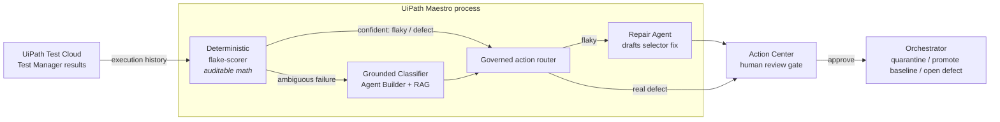

# FlakeWarden

**Agentic flaky-test triage and self-healing reviewer for UiPath Test Cloud.**

**90.7% triage accuracy · a measured 0% safety-direction false-positive rate** on a 150-case labeled corpus.

UiPath AgentHack 2026, **Track 3: UiPath Test Cloud**

**[Watch the demo (3 min)](https://www.youtube.com/watch?v=6md-vEuY_-0&t=1s)**  ·  [Slide deck (PDF)](https://jonathanandrei.com/decks/flakewarden-deck.pdf)  ·  [Blog post](https://jonathanandrei.com/blog/flakewarden-agentic-flaky-test-triage-uipath-maestro/)

---

Flaky tests are the most corrosive failure mode in CI. When a red build might be a
real regression *or* just noise, engineers either burn time triaging every failure
or, worse, start ignoring red builds, and a genuine regression ships. Google's
continuous-testing study reported that **~16% of their tests had some level of
flakiness** and that **~84% of pass→fail transitions came from flaky tests**
(J. Micco, [*Flaky Tests at Google and How We Mitigate Them*](https://testing.googleblog.com/2016/05/flaky-tests-at-google-and-how-we.html),
Google Testing Blog, 2016; corroborated by Memon et al., *Taming Google-Scale
Continuous Testing*, ICSE-SEIP 2017). As an
illustrative model: at a 5% flake rate a 2,000-test suite produces ~100 spurious
failures per full run, and at an assumed 15–45 minutes of triage each that is tens
of engineer-hours per cycle (the per-failure minutes are an assumption, not a
measured figure).

FlakeWarden looks at a failing test's execution history and the surrounding
evidence and answers the only question that matters: **is this a real defect, a
flaky test, or an environment problem?** It then routes each failure to the right
action, with a human in charge of every change.

The design follows one principle: **deterministic where it must be exact,
generative where the context is messy.**

- A **deterministic flake-scorer** (auditable statistics over run history) handles
  the clear cases and never guesses.
- A **grounded Agent Builder classifier** (RAG over stack traces, DOM diffs, commit
  messages, and runner logs) reasons over only the ambiguous failures.
- **UiPath Maestro** orchestrates the two plus a **Repair Agent**, and every fix or
  quarantine passes through a mandatory **Action Center** human-review gate.

**What makes it different:** detection tools (Datadog, Develocity, Trunk) only flag
flaky tests; healing tools (Healenium, Tricentis, UiPath Autopilot) only patch
selectors. FlakeWarden's moat is the composition: it **decides** between real defect,
flaky, and environment, then routes each to a governed, human-gated UiPath action,
under a measured **0% safety-direction false-positive** contract
([`docs/prior-art.md`](docs/prior-art.md)).

## Measured results (not just a demo)

Run against a labeled corpus of **150 failures** (`corpus/failures.jsonl`, on the
offline rule-based classifier so the numbers reproduce with no API key):

| Metric | Result |
|---|---|
| Overall accuracy | **90.7%** |
| **Safety false-positive rate** (real defect hidden as flaky/environment) | **0.0%** |
| Noise false-alarm rate (flaky/env over-escalated as defect) | 12.0% |
| Failures resolved by deterministic scorer (no LLM spent) | 52 / 150 |
| Failures escalated to the grounded classifier | 98 / 150 |

The architecture **forces every error into the safe direction**: the deterministic
scorer only auto-resolves a defect on a positive selector fingerprint, a
flaky-looking history with any regression hint is double-checked by the classifier,
and the classifier tie-breaks toward *real defect* when evidence is split. On this
corpus that yields a measured **0% safety false-positive rate** (no real regression
hidden) and a **0% auto-heal-of-a-defect rate**, enforced as a hard gate by
`eval/negative_control.py`. The 12% noise (a flaky test escalated as a defect)
wastes a little triage but hides nothing. These numbers are measured on a
synthetic-but-adversarial corpus, not a production study — see
[`docs/limitations.md`](docs/limitations.md). Reproduce with `python eval/harness.py`;
full report in [`eval/report.md`](eval/report.md).

## Architecture



See [`ARCHITECTURE.md`](ARCHITECTURE.md) for the full data flow and the
deterministic-vs-generative boundary. For how this differs from detection tools
(Datadog, Develocity, Trunk) and healing tools (Healenium, Tricentis, UiPath
Autopilot), and the defensible uniqueness claim, see
[`docs/prior-art.md`](docs/prior-art.md).

## Running live on UiPath Automation Cloud

What is actually deployed and verified on the platform (not mocked):

- **Triage Classifier agent** — built in **UiPath Agent Builder** (Studio Web) with
  a grounded context, a structured output schema, an evaluation set, and an
  AI-Trust-Layer model. **Verified live across all three classes**: real_defect
  (0.95), flaky (0.86, with a proposed fix), environment (0.97), each with correct,
  evidence-cited reasoning. **Published (v1.0.0) and deployed as an Orchestrator
  process** (`Solution.1.agent.Agent`).
- **Maestro BPMN orchestration** ([`flakewarden-maestro/`](flakewarden-maestro/)) —
  Start → agent call (`Orchestrator.StartAgentJob`) → verdict extraction → exclusive
  gateway on the label → three routed branches (flaky → human-gated heal, real_defect
  → escalate, environment → re-run). **Authored entirely through the `uip` CLI** and
  passing `uip maestro bpmn validate`.
- **Built with a coding agent end to end** — the agent scaffolding and the entire
  Maestro orchestration were produced by **Claude Code driving the UiPath `uip` CLI**
  (UiPath for Coding Agents): `uip login`, `uip skills`, `uip tools install`,
  `uip agent deploy`, `uip maestro bpmn registry/init/validate`. See
  [`docs/coding-agents.md`](docs/coding-agents.md).

Documented next step (honest): wiring the deployed agent's Orchestrator job-argument
envelope and a serverless robot to the agent folder so the BPMN runs the agent
end-to-end unattended, plus an Action Center action app for the in-Maestro human gate.
The agent itself runs correctly today (verified in Agent Builder); these are the
deployment-plumbing steps between "agent runs" and "BPMN runs the agent unattended."

## UiPath components used

| Component | Role |
|---|---|
| **UiPath Test Cloud / Test Manager** | Source of test execution history; target for quarantine + baseline promotion |
| **UiPath Maestro** | Orchestrates scorer → classifier → repair agent → human gate (see [`maestro/`](maestro/)) |
| **UiPath Agent Builder** | Hosts the grounded Triage Classifier and Repair Agent ([`agents/`](agents/)) |
| **UiPath Healing Agent™** | (Optional) GA platform feature that applies an approved selector repair at runtime; distinct from our Repair Agent |
| **Context Grounding (hybrid RAG)** | Grounds the classifier in Test Manager artifacts, DOM diffs, and commits |
| **Action Center** | Mandatory human-review task before any quarantine / heal / baseline change |
| **Orchestrator** | Hosts the deployed solution package; executes governed write-backs |
| **AI Trust Layer** | PII redaction + audit logging around every agent call |

## Agent type: Both (Coded Agents + Low-code Agents)

**Direct answer to the judging question: both.** A low-code UiPath Agent Builder
agent does the grounded reasoning, a coded Python agent does the exact and auditable
scoring, and the entire build was driven by a coding agent (the UiPath for Coding
Agents bonus).

| Layer | What it is | UiPath surface |
|---|---|---|
| **Low-code agent** *(deployed live)* | Triage Classifier + Repair Agent: grounded sources, structured output schema, guardrails, and an eval set with a release gate. Published v1.0.0, deployed as an Orchestrator process. | UiPath Agent Builder ([`agents/`](agents/)) |
| **Coded agent** | Deterministic flake-scorer, classifier interface, and eval harness: exact, auditable logic the low-code layer calls. | UiPath Coded Agents / Python ([`flakewarden/`](flakewarden/)) |
| **Built with a coding agent** *(bonus)* | The whole solution and the entire Maestro BPMN, scaffolded and iterated end to end. | Claude Code driving the `uip` CLI ([`docs/coding-agents.md`](docs/coding-agents.md)) |

## Quickstart (local, no UiPath account needed)

Runs fully offline with a deterministic rule-based classifier; set
`ANTHROPIC_API_KEY` to route the ambiguous band through a real Claude model.

```bash
python --version                      # 3.10+

# 1. Generate the labeled evaluation corpus (deterministic, seeded)
python corpus/generate_corpus.py

# 2. Reproduce the measured accuracy + false-positive rate
python eval/harness.py --report eval/report.md

# 3. Prove the safety invariants hold (gates CI)
python eval/negative_control.py

# 4. End-to-end on a freshly-run seeded test suite
python seeded_suite/run_history.py --runs 14
python -m flakewarden.cli triage seeded_suite/history.jsonl
```

## Deploy on UiPath Automation Cloud

Step-by-step wiring into your UiPath Labs tenant (Maestro process, Agent Builder
agents, Test Manager connection, Action Center, `uip` CLI packaging and deploy) is
in [`SETUP.md`](SETUP.md).

## Repository layout

```
flakewarden/      deterministic scorer, grounded classifier, orchestration, CLI
agents/           Agent Builder definitions + the grounded classifier prompt
maestro/          Maestro process definition + step-to-component mapping
flakewarden-maestro/  CLI-authored, registry-valid Maestro BPMN (passes uip maestro bpmn validate)
corpus/           labeled evaluation corpus + its deterministic generator
seeded_suite/     a seeded flaky test suite + history exporter (demo data source)
eval/             accuracy/false-positive harness + negative-control gate
tests/            unit tests for the scorer and orchestration invariants
docs/             prior-art, limitations, deploy runbook, demo script, presentation outline, coding-agents note
```

## Honest limitations & path to production

See [`docs/limitations.md`](docs/limitations.md). In short: the corpus is
synthetic-but-adversarial (a solo builder cannot ship a real enterprise's CI
history); production requires connecting the live Test Manager results API and a
prospective accuracy study against a gold-standard labeled set. The architecture,
governance gates, and eval methodology are production-shaped; the data is the gap.

## License

[MIT](LICENSE).
